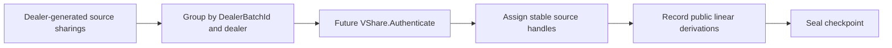
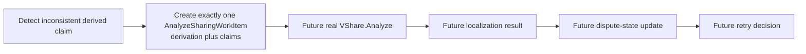

# Freeze GOD paper-to-code control-plane contract

## 0. Status, scope, and authority

This document freezes the paper-to-code architecture contract that must be
settled before adding more GOD metadata or implementing any real GOD protocol
behavior. It is an analysis of the current code, not a claim that the listed
paper interfaces are implemented.

The contract was derived at repository commit
`fd859c5e7f84b38e8487dbb3e806d6a0cf68e846` from:

- `Protocols/AtlasGsz.h` and `Protocols/AtlasGsz.hpp`;
- `Protocols/Atlas.h` and `Protocols/Atlas.hpp`;
- the current technical core in `prelim.tex`, `online.tex`, and `prep.tex`
  from the local read-only GOD PPML paper tree;
- the full [GSZ20 reference](https://eprint.iacr.org/2020/189.pdf), used only
  to clarify the source-batch authentication model and the intended lifetimes
  of `mu` and `nu`.

For this contract, the current technical core is authoritative for the GOD
PPML interface. GSZ20 is supporting evidence where the technical core is
abstract. Current C++ metadata is an inventory to migrate, not a competing
semantic specification. Any point not fixed by those sources is explicitly
marked **UNRESOLVED** and must not be silently chosen during a refactor.

The central provenance invariant is:

```text
dealer-generated source batch
    -> VShare.Authenticate
    -> stable authenticated source handles
    -> public linear derivations
    -> checkpoint outputs and, on failure, VShare.Analyze
```

The reverse direction is invalid. A derived output or a published failure
snapshot cannot be made into an authenticated source after the fact.

## 1. Current implementation inventory

### 1.1 Persistent state versus transient views

`AtlasGsz` currently mixes operational multiplication-verification state with
an extensive metadata/diagnostic GOD skeleton.

| Area | Persistent member state | Transient or nested results | What it currently represents |
| --- | --- | --- | --- |
| Verification batch | `x_verify`, `y_verify`, `z_verify`, `z_de_linearized`, and `partial_mult_transcripts` | `PartialMultTranscriptRecord` | Pending multiplication or dot-product relations and their source transcript coverage. |
| Virtual transcript | `current_virtual_transcript`, `current_virtual_king_evidence`, and presence flags | Atlas `PartialMultTranscript` and `KingPartialMultEvidence` | The transcript/evidence produced by de-linearization, dimension reduction, and randomization. |
| Ultimate failure | `ultimate_failure_context` and `have_ultimate_failure_context` | `UltimateFailureDecision`, published sharing views, `CheckDoubleRandContext`, localization/request/application results | Evidence and the diagnostic branch retained when the ultimate tuple fails. |
| Dispute control | `dispute_control_state` | `FaultLocalizationOutcome`, update plan, application result, and wrapper | Public `Corr`/`Disp` metadata and proposed/applied diagnostic updates. |
| Sharing/checkpoint registry | `verifiable_registry` | `RegisteredVerifiableSharing`, `CheckpointRecord` | Local shares, published snapshots, checkpoint membership, and coarse statuses. |
| Segment lifecycle | `segment_lifecycle` | completion-readiness and recovery decision/application results | One monotonically increasing segment counter, open flags, and input/output checkpoint IDs. |
| Authentication | `authentication_plan_state` and `authentication_material_state` | equation, vote, holder, sharing, checkpoint, outcome, hook, promotion, and Analyze-plan layers | Placeholder per-sharing/per-verifier/per-holder metadata. No real VShare/FTag is present. |
| Pending Analyze-Sharing | request, dispatch, and execution-attempt states | enqueue, dispatch, retention, readiness, attempt, and run plans/results | Repeated snapshots of future-work metadata. No real Analyze-Sharing call is present. |
| Segment recovery | no separate authoritative resource store | recovery decision and application results | Metadata-only promotion, completion, or Analyze enqueue selection. No retry or rollback is present. |

The persistent state containers are:

- `DisputeControlState`: an initialized flag, `corr`, and symmetric `disp`;
- `VerifiableSharingRegistry`: next sharing/checkpoint IDs, a duplicated
  `current_segment_id`, and vectors of registered sharings/checkpoints;
- `SegmentLifecycleState`: current and last-completed segment IDs, open flags,
  current input/output checkpoint IDs, and current input/output sharing IDs;
- `AuthenticationPlanState` and `AuthenticationMaterialState`: monotonically
  assigned record IDs and vectors of placeholder records;
- `PendingAnalyzeSharingState`, `PendingAnalyzeSharingDispatchState`, and
  `PendingAnalyzeSharingExecutionAttemptState`: three retained stores for
  substantially the same future work at different inspection stages.

These containers are private skeletons. The segment/checkpoint/recovery entry
points are not wired into real online segment execution. The existence of a
field or transition therefore does not establish paper-correct behavior.

### 1.2 Virtual transcripts and `UltimateFailureContext`

Atlas supplies the operational evidence primitives:

- `DealerDoubleSharingContribution` stores the dealer's degree-`t` and
  degree-`2t` components;
- `OwnDealerDoubleSharingEvidence` stores this party's published dealer-side
  share vectors;
- `DoubleSharingDecomposition` keeps dealer components, own-dealer evidence,
  and the validated residual;
- `PartialMultTranscript` stores `r_t`, `r_2t`, `e_2t`, `e_t`, the king, and
  the random-mask decomposition;
- `KingPartialMultEvidence` stores what the king received as `e_2t` and
  distributed as `e_t`.

`PartialMultTranscriptRecord` adds the verification-vector `offset` and
`length` and optionally attaches king evidence. De-linearization combines
these records into the current virtual transcript; dimension reduction
replaces it with interpolated virtual transcripts; randomization produces the
ultimate scalar transcript.

`UltimateFailureContext` is the retained failure envelope. It contains:

- the king and `UltimateFailureKind`;
- published views of `alpha`, `beta`, `delta_t`, `delta_2t`, `eta_2t`,
  `eta_t`, and `gamma`;
- the local double-sharing decomposition and optional
  `CheckDoubleRandContext`;
- published king evidence and the two mismatch-party lists;
- `UltimateFailureDecision`, `FaultLocalizationOutcome`, and
  `FaultLocalizationApplication`;
- optional `AnalyzeSharingRequest` and
  `UltimateFailureAnalyzeEnqueueResult`.

On ultimate failure, this context is installed and retained before `mac_fail`
is thrown. `PublishedDegreeTSharing` and `PublishedDegree2TVector` are public
evidence views. They are not authenticated handles and do not prove the
provenance of the represented sharing.

### 1.3 Fault localization and dispute-control updates

`FaultLocalizationOutcome` normalizes a diagnosis into one of four states:
no action, needs Analyze-Sharing, identify a corrupted party, or identify a
disputed pair. Its source records whether the evidence came from inconsistent
`alpha`/`beta`, a local transcript equation, king evidence, or double-sharing
diagnosis.

`DisputeControlUpdatePlan` previews the consequence of an outcome against a
copy of `Corr`/`Disp`, including the `t+1` dispute-count closure. The matching
application result records the mutation and newly added parties/pairs.
`FaultLocalizationApplication` is a smaller wrapper over that result. Thus the
current code has two representations of the same application boundary.

An inconsistent `alpha` or `beta` currently produces a pending Analyze path
without changing `Corr`/`Disp`. Directly localizable diagnostic branches can
update the dispute state immediately. This is diagnostic skeleton behavior;
it is not real Localize or majority-driven dispute-update wiring.

### 1.4 Verifiable-sharing and checkpoint registry

`RegisteredVerifiableSharing` is a union-like record containing:

- one numeric ID, degree, kind, and status;
- a local share;
- an optional vector of published shares;
- a segment ID and checkpoint ID.

Its kinds combine checkpoint inputs, checkpoint outputs, segment
intermediates, and post-failure Analyze snapshots. It has no dealer identity,
batch identity, authenticated handle, source ordinal, or public derivation.

`CheckpointRecord` owns a list of sharing IDs and the flags `sealed`,
`authentication_requested`, and `authenticated`. Input versus output role is
only inferable from surrounding lifecycle state and sharing kinds. The
registry also stores `current_segment_id`, duplicating lifecycle ownership.

`register_published_degree_t_snapshot()` creates an `analysis_pending`
registered sharing with a zero local share and the published claims. This is
evidence registration, despite its placement in the verifiable-sharing
registry.

### 1.5 Segment lifecycle

`SegmentLifecycleState` has only one segment identity. `begin_segment()`
increments it, so the model cannot express multiple attempts of the same
logical paper segment. The state tracks an input checkpoint, an output
checkpoint, and registered input/output sharings.

`abandon_current_segment_after_failure()` closes flags but deliberately
retains registry metadata. It does not distinguish the authenticated
checkpoint that must survive from the transcripts, masks, solved values,
double sharings, outputs, and other resources that must not be reused. It has
no callers that perform real rollback, restart, or re-evaluation.

### 1.6 Authentication plan, material, equation, vote, and decision layers

The current placeholder stack is:

1. `AuthenticationPlanRecord`: one record for a sharing/checkpoint/segment and
   an ordered `(verifier, holder)` pair;
2. `AuthenticationMaterialRecord`: repeats that identity and stores placeholder
   `mu`, `nu`, and holder tag fields;
3. `AuthenticationEquationResult`: tests the local placeholder equation
   `tag == mu * holder_share + nu`;
4. `AuthenticationVerifierVote`;
5. `AuthenticationHolderDecision`, with threshold `t+1`;
6. `AuthenticationSharingDecision`;
7. `AuthenticationCheckpointDecision`;
8. `AuthenticationDecisionOutcome` and `AuthenticationOutcomeHookResult`;
9. `AuthenticationPromotionResult`, or an
   `AuthenticationAnalyzeSharingPlan` followed by an enqueue result.

`create_checkpoint_authentication_plan()` iterates over each registered
checkpoint-output sharing and every ordered pair of active parties other than
self-pairs. It therefore treats a derived checkpoint output as the object to
authenticate. Promotion marks those output records and their checkpoint
authenticated; it does not assign stable handles to dealer-generated source
sharings.

Material records link to a plan ID but also copy the sharing, checkpoint,
segment, verifier, holder, and kind. `mu`, `nu`, and tag are co-located in the
same central record. There is no key owner, key epoch, long-term `mu` reuse, or
per-dealer-batch `nu` lifetime.

The vote aggregation uses current active verifiers other than the holder, but
the rejection threshold remains the original `t+1`. It can report
`insufficient_votes` when the active verifier population falls below that
threshold. The correct verifier population and quorum after `Corr` becomes
nonempty are not defined by this skeleton.

### 1.7 Pending Analyze-Sharing request through run-plan layers

There are two current entry paths:

- authentication rejection creates a request targeting a registered
  checkpoint-output sharing and carries rejected holder IDs;
- ultimate-tuple failure creates a request targeting published `alpha` or
  `beta` and carries a registered snapshot plus authentication plan/material
  IDs.

The same identity and future-action flags are then copied through:

1. `PendingAnalyzeSharingRequest` in `PendingAnalyzeSharingState`;
2. `PendingAnalyzeSharingDispatchPlan`;
3. retained `PendingAnalyzeSharingDispatchRecord` and dispatch state;
4. `PendingAnalyzeSharingDispatchRetentionResult`;
5. `PendingAnalyzeSharingExecutionReadinessPlan`;
6. retained `PendingAnalyzeSharingExecutionAttemptRecord` and attempt state;
7. `PendingAnalyzeSharingExecutionAttemptResult`;
8. `PendingAnalyzeSharingExecutionAttemptRunPlan`.

Repeated aliases include
`sharing_id == registered_checkpoint_output_sharing_id` and
`registered_snapshot_id == ultimate_failure_snapshot_id`. A queue index is
also persisted even though later queue mutation would make such an index
unstable. The final run plan only says that it *would* execute Analyze-Sharing
and feed later stages. It performs no protocol call.

There is no erase, pop, dequeue, claim, completion, or consumption transition.
Those semantics remain intentionally unresolved.

### 1.8 Segment recovery decision and application layers

`SegmentRecoveryDecisionResult` combines checkpoint state, authentication
outcome/hook state, completion readiness, Analyze planning, and pending request
IDs into a read-only choice. `SegmentRecoveryApplicationResult` can record one
metadata action: promote a checkpoint, complete an authenticated segment, or
enqueue Analyze requests.

Neither type identifies retained versus tentative resources. Neither applies
a retry, rolls back a segment, chooses a fresh attempt ID, or re-evaluates
anything.

## 2. Paper-semantic contract

### 2.1 `VShare.Authenticate` certifies dealer batches

The current technical core defines a session-scoped stateful `VShare` with a
private authenticated table `Auth` (`prelim.tex`, VShare functionality).
`Authenticate` receives the same public `(bid, P_d, q)` from the honest active
parties and receives each party's shares in the `q` sharings dealt by dealer
`P_d`.

It validates the dealer, freshness of `(bid, P_d)`, field membership, and that
every submitted vector is a dispute-compatible degree-`t` sharing dealt by
that dealer. If the checks succeed, it creates the public handles

```text
h_j = (bid, P_d, j)
```

and privately stores the corresponding source vectors in `Auth`. Those
handles are stable public source identities for the protocol session. If
authentication fails, fault localization runs and the batch is not stored.

Authentication certifies consistent dealer-generated sharing vectors. It does
not certify that a corrupt dealer selected an externally prescribed secret.

### 2.2 Checkpoints are derivations, not newly authenticated sharings

Random sharing, double sharing, refresh, partial multiplication, and local
linear operations preserve public decompositions into dealer-generated source
sharings. The parties must retain those decompositions.

For an accepted segment, each output checkpoint sharing is therefore a public
linear derivation over authenticated source handles. The checkpoint stores or
references the derivation; it does not call `Authenticate` on the derived
output as if that output were a newly dealt source.

The preprocessing flow makes this ordering explicit:

1. generate dealer source sharings and record each derived random sharing's
   public decomposition;
2. call `VShare.Authenticate` once for each contributing dealer batch;
3. treat the derived random sharings as the authenticated checkpoint;
4. retain that checkpoint across square-computation retries.

The online flow has the same provenance: authenticate the degree-`t` sharings
dealt during the accepted segment, then use their public linear combinations
as the next checkpoint.

### 2.3 `VShare.Analyze` adjudicates a derivation and claims

For a public derivation

```text
Delta = ((a_1, h_1), ..., (a_q, h_q)),
```

`VShare.Analyze` obtains each active party's claimed derived share and computes
the canonical share from the already authenticated source vectors behind the
handles. It checks that every handle exists, every claim is a field element,
and every claim equals the canonical linear combination. A mismatch invokes
fault localization.

Consequently:

- Analyze consumes existing authenticated source handles; it creates no new
  handle;
- Analyze does not authenticate a suspicious sharing after a failure;
- a published inconsistent `alpha`/`beta` vector is a set of party claims and
  failure evidence;
- that published snapshot is not a replacement source sharing, is not inserted
  into `Auth`, and must never be the input to a post-failure Authenticate step.

The canonical Analyze payload is therefore **derivation plus claims**, not a
snapshot ID plus newly manufactured authentication placeholders.

### 2.4 Authentication material lifetime

The technical core intentionally abstracts real FTag material. GSZ20 clarifies
the operational ownership that a later realization must preserve:

- `mu_(v->i)` is a long-term key owned by verifier `P_v` for holder `P_i`;
- `mu` is reused across batches and segments while its key epoch remains valid;
- `nu` is fresh per authenticated dealer batch (and per applicable
  verifier/holder relation);
- the holder owns the corresponding tag, while the verifier owns the key and
  batch offset needed to check it.

The target metadata must represent those lifetimes without centralizing all
private values or copying batch/checkpoint/sharing identity into every material
record. This document does not choose key-distribution, storage, rotation, or
communication mechanics.

### 2.5 Retention and retry semantics

The paper distinguishes durable provenance from attempt-local resources:

- a successfully authenticated dealer batch, its handles, retained public
  derivations, and a sealed checkpoint survive a retry that resumes from that
  checkpoint;
- an authentication failure stores no batch and restarts the affected random
  batch;
- a preprocessing square-verification retry retains the authenticated random
  source sharings but discards tentative bit outputs and fresh attempt
  randomness;
- an online failed attempt discards attempt outputs, transcripts/material that
  cannot be reused, and all solved values consumed or revealed in that attempt;
- a double-sharing component that was opened or involved in a failed segment
  is not reused.

This requires separate logical-segment and attempt identities plus an explicit
retained/tentative resource classification.

### 2.6 Explicit unresolved paper/realization questions

The following are not frozen to an invented answer:

1. **Verifier population and quorum after `Corr` is nonempty.** The ideal
   VShare interface abstracts votes. GSZ20 applies active/dispute eligibility
   conditions and uses both `t+1` and “majority” language in different
   subprocedures. It does not directly define the indexing and denominator for
   the current C++ vote hierarchy after parties leave the active set. The set
   `T` of size `t+1` used by segment computation is not automatically the
   verifier quorum.
2. **Public affine constants.** VShare's displayed `Delta` is homogeneous,
   while preprocessing records derivations such as
   `[d]_t = c[a]_t + 1/2`. Publicly determined sharing terms are handled by residual normalization: each party subtracts its public local share before invoking `Analyze`. `LinearDerivation` therefore remains homogeneous and contains only coefficient–authenticated-handle terms.
3. **Key epochs and rotation.** The precise event that invalidates reusable
   `mu` material after a dispute-state change must follow the chosen real FTag
   proof and is not selected here.
4. **Claim visibility and malformed/missing encodings.** The ideal
   functionality accepts submissions; current ultimate-failure evidence is
   broadcast. A real interface must specify which claim fields become public.
5. **Handle and checkpoint retirement.** Garbage-collection rules are not in
   the current technical core.
6. **Pending-work ownership and consumption.** Claiming, ordering,
   deduplication, dequeue atomicity, completion marking, audit retention, and
   whether retry waits for Analyze completion are unresolved.

## 3. Current mismatch table

| Contract point | Current C++ model | Required direction |
| --- | --- | --- |
| Authentication unit | `create_checkpoint_authentication_plan()` creates records for every `checkpoint_output` sharing and active verifier/holder pair. | Authenticate batches of dealer-generated source sharings grouped by `DealerBatchId` and dealer. |
| Successful identity | Promotion marks derived sharing records/checkpoint flags authenticated. | Successful Authenticate assigns stable public `AuthenticatedSharingHandle` values to source sharings. |
| Checkpoint meaning | A checkpoint owns output sharing IDs and is treated as the direct authentication target. | A checkpoint output references a public `LinearDerivation` over authenticated handles. |
| Post-failure snapshot | `build_analyze_sharing_request()` registers published `alpha`/`beta`, creates an Analyze-snapshot authentication plan, and creates material placeholders after failure. | Register the publication only as claims/evidence and create one Analyze work item referencing the pre-existing derivation and source handles. Never authenticate the snapshot. |
| Registry provenance | `RegisteredVerifiableSharing` has degree/kind/status/local share/snapshot plus segment/checkpoint IDs. | Split authenticated source batches/handles, public derivations, and derived claims. Add dealer ID, batch ID, handle ID, and source ordinal. |
| Pending Analyze payload | Pending requests carry sharing/snapshot/auth-record IDs and rejected holders, but no canonical public derivation or complete party claims. | `AnalyzeSharingWorkItem` owns one derivation and the corresponding claims/evidence. |
| Authenticate versus Analyze | Authentication rejection is converted into a plan to Analyze a rejected checkpoint-output sharing. | Authenticate-time batch certification/localization and Analyze-time adjudication of an already-authenticated derivation are distinct interfaces. |
| Material ownership | One material record co-locates `mu`, `nu`, tag, and copies all identity metadata. | Model verifier-owned long-term `mu`, fresh batch-associated `nu`, holder-owned tag, and links to the authoritative batch/plan. |
| Verifier/quorum rule | All active non-self ordered pairs are planned; rejection uses fixed `t+1`, and acceptance also waits for every expected active vote. | **UNRESOLVED:** specify dealer/dispute-aware eligible verifiers and the post-`Corr` acceptance/localization rule from the selected FTag realization before implementation. |
| Segment identity | One monotonically increasing `segment_id` represents both logical position and execution instance. | Use stable `LogicalSegmentId` plus fresh `SegmentAttemptId` for every retry. |
| Resource lifetime | “Abandon” closes flags while retaining all registry metadata; recovery has no resource sets. | Explicitly separate retained authenticated provenance/checkpoints from tentative attempt resources that must be discarded. |
| Work pipeline | Dispatch, retained dispatch, readiness, retained attempt, result, and run plan repeatedly copy the same payload. | One authoritative work item plus small, non-authoritative transient inspection/transition results. |
| Localization application | `FaultLocalizationApplication` duplicates much of the dispute-control application result. | Use one canonical localization result and one canonical dispute-state transition receipt. |
| Linear form | No handle-based derivation exists. | Record coefficient/handle terms and resolve the public-constant representation before real behavior. |

The most important mismatch is the provenance reversal across the first four
rows: current code authenticates derived outputs and post-failure evidence,
while the paper authenticates dealer sources first and analyzes later claims by
following public derivations back to those stable source handles.

## 4. Canonical target entities

These are conceptual entities, not proposed C++ syntax. IDs may later become
strong value types, but this milestone creates no enum, record, queue, or
protocol action.

| Entity | Minimal semantic content | Owner | Lifetime | Visibility | Survives retry? | Paper producer -> consumer |
| --- | --- | --- | --- | --- | --- | --- |
| `DealerBatchId` | Session-unique identity for one fresh batch; associated with exactly one dealer and source ordering. | Public batch coordinator/registry. | From batch formation while handles or diagnostics depend on it. | Public. | Only a successfully authenticated batch identity is retained; a failed tentative batch is not. | Batch formation -> `VShare.Authenticate`. |
| `AuthenticatedSharingHandle` | Stable identity of one source sharing, semantically `(batch, dealer, ordinal)`. | VShare authenticated-source registry; each party retains its backing local share. | Until no retained derivation/checkpoint depends on it. | Handle public; backing sharing vector/private share is private. | Yes after successful Authenticate. | Produced by Authenticate -> consumed by `LinearDerivation` and Analyze. |
| `AuthenticatedDealerBatch` | Batch ID, dealer, ordered handles/source ordinals, certification state, and links to applicable key/material records. | Distributed VShare/authenticated-source registry. | Session or until every dependent handle retires. | Identity, dealer, ordering, status, and handles public; source shares and auth material private. | Yes after success; no record is promoted on Authenticate failure. | Authenticate input/result -> source for checkpoint derivations. |
| `LinearDerivationTerm` | `{coefficient, handle}`. | Immutable derivation registry or owning checkpoint/work item. | Same as the containing derivation. | Public. | Yes if its containing derivation and handle are retained. | Public linear operation -> `LinearDerivation`. |
| `LinearDerivation` | Canonical ordered/normalized terms and, subject to resolution, a public constant. | Derivation/checkpoint registry. | Until every dependent checkpoint/work item retires. | Public. | Retained derivations survive; attempt-only derivations do not. | Local/public linear evaluation -> checkpoint seal and `VShare.Analyze`. |
| `DerivedSharingClaim` | Claimant party, claimed field element or explicit missing/malformed marker, provenance, and associated attempt. | Claimant before submission; Analyze work/evidence registry after collection. | Detection through adjudication; optional later audit only. | Submission visibility is **UNRESOLVED**; an already published alpha/beta claim is public evidence. | Not as active state for a new attempt, and never as authenticated source state. | Failure publication/submission -> Analyze. |
| `AnalyzeSharingWorkItem` | Work ID, derivation, claims, failure source, checkpoint, logical segment, attempt, and minimal processing state. It contains no new auth placeholders. | One pending-work registry. | Detection through future Analyze, localization, dispute update, and retry decision; retirement policy unresolved. | Public provenance/derivation; claims keep their specified visibility; local scheduling fields are local. | Bound to the failed attempt. It may be retained for adjudication/audit, but is not reused by a later attempt. | Inconsistent derived claim -> future `VShare.Analyze`. |
| `LogicalSegmentId` | Stable identity of one segment in the public computation partition. | Program partition/scheduler. | Whole protocol execution. | Public. | Yes; all retries use the same logical ID. | Segment partition -> attempt, checkpoint, and recovery metadata. |
| `SegmentAttemptId` | Unique identity of one execution of a logical segment. | Segment-attempt scheduler. | One attempt; optional diagnostic retention afterward. | Public metadata. | No. Retry creates a fresh attempt ID. | Attempt start -> tentative resources, transcripts, claims, recovery. |
| `CheckpointId` | Stable identity and role of a sealed provenance boundary; references output derivations and backing handles. | Checkpoint registry. | Seal through the last dependent segment/output. | ID/status/derivations public; local backing shares private. | A sealed accepted checkpoint survives. A tentative candidate is not promoted merely because it has an ID. | Checkpoint sealing -> next segment and Analyze provenance. |
| `LongTermMuKey` | Key ID/epoch and `(verifier, holder)` ownership; no dealer or batch index. | Verifier. | Across batches/segments while its epoch remains valid. | Private authentication material. | Yes while valid; rotation conditions are unresolved. | Future FTag key setup -> batch tag checks. |
| `BatchNuMaterial` | Fresh material linked to one dealer batch, verifier, holder, and long-term key epoch; corresponding tag link. | Verifier owns `nu`; holder owns tag; registry stores only authorized references. | One authenticated batch and any later verification that needs it. | Private. | It may remain attached to a retained authenticated batch, but is never reused for another batch. | Future Authenticate/FTag -> later verification/localization. |
| `RetainedResources` | Authenticated batches/handles, stable derivations, sealed checkpoint, completed-segment state, and other explicitly reusable material. | Segment/checkpoint resource controller. | Across attempts until dependent state retires. | Mixed; each contained object preserves its own visibility. | Yes. | Successful Authenticate/checkpoint seal -> retry input. |
| `TentativeAttemptResources` | Current outputs, transcripts, challenges, masks, double sharings, consumed/revealed solved values, tentative auth material, and attempt-local claims. | Segment-attempt controller. | Exactly one `SegmentAttemptId`. | Mixed. | No; promotion moves only explicitly validated resources, and the rest is discarded. | Attempt execution -> verification, failure evidence, or explicit promotion. |

The target identity graph is acyclic and authoritative:

```text
LogicalSegmentId
  `-- SegmentAttemptId
        |-- tentative transcripts/resources
        |-- DealerBatchId --successful Authenticate--> source handles
        `-- derived claim --references--> LinearDerivation --references--> source handles

CheckpointId --owns/references--> retained LinearDerivation values
```

No transient result should copy this graph wholesale. It should carry the
smallest stable IDs needed to inspect the authoritative records.

## 5. Struct disposition table

The classifications below cover all 47 control-plane/failure structs declared
in `AtlasGsz.h`. `KEEP BUT REDESIGN` is abbreviated as **REDESIGN** in the
totals. “Merge” describes the target architecture; it is not an instruction to
delete an API before adapters exist.

| Current struct | Disposition | Target role or reason |
| --- | --- | --- |
| `PartialMultTranscriptRecord` | KEEP | Useful coverage wrapper for operational transcript/evidence. |
| `UltimateFailureDecision` | KEEP | Compact diagnostic decision remains distinct from evidence and application. |
| `PublishedDegreeTSharing` | REPLACE | Split raw public party claims from derived consistency classification; neither is an authenticated sharing. |
| `PublishedDegree2TVector` | KEEP | Useful diagnostic public view for current double-sharing fault analysis. |
| `CheckDoubleRandDecision` | KEEP | Compact double-sharing diagnosis. |
| `CheckDoubleRandContext` | KEEP | Retained evidence bundle remains useful; attempt/resource ownership is supplied by its owner. |
| `AnalyzeSharingRequest` | REPLACE | Replace with one canonical `AnalyzeSharingWorkItem` containing derivation and claims. |
| `PendingAnalyzeSharingRequest` | REPLACE | Same canonical work item; remove snapshot-auth IDs and copied identities. |
| `PendingAnalyzeSharingState` | KEEP BUT REDESIGN | Become the sole authoritative store of canonical work items; no consumption policy yet. |
| `UltimateFailureAnalyzeEnqueueResult` | MERGE | Reduce to a small transition receipt over work-item ID. |
| `RegisteredVerifiableSharing` | REPLACE | Split into authenticated batches/handles, derivations/checkpoints, and claims/evidence. |
| `CheckpointRecord` | KEEP BUT REDESIGN | Reference derivations and source handles; distinguish role and sealed/tentative state. |
| `VerifiableSharingRegistry` | KEEP BUT REDESIGN | Become focused source, derivation, and checkpoint registries with single ownership of counters. |
| `SegmentLifecycleState` | KEEP BUT REDESIGN | Separate logical segment, attempt, checkpoint, retained resources, and tentative resources. |
| `AuthenticationPlanRecord` | KEEP BUT REDESIGN | Make the plan dealer-batch oriented and reference authoritative identities. |
| `AuthenticationPlanState` | KEEP BUT REDESIGN | Store batch plans/key-epoch links rather than output-sharing plans. |
| `AuthenticationMaterialRecord` | KEEP BUT REDESIGN | Link to batch/plan/key epoch; remove copied identity fields and split private ownership. |
| `AuthenticationMaterialState` | KEEP BUT REDESIGN | Index material by authoritative batch/key relationships and lifetime. |
| `AuthenticationEquationResult` | KEEP BUT REDESIGN | Small transient check result after real material semantics are fixed. |
| `AuthenticationVerifierVote` | KEEP BUT REDESIGN | Retain only if the chosen FTag realization actually has this vote abstraction. |
| `AuthenticationHolderDecision` | KEEP BUT REDESIGN | Resolve eligible verifier set and quorum first; keep it transient. |
| `AuthenticationSharingDecision` | KEEP BUT REDESIGN | Redesign around authenticated source/batch semantics, not derived outputs. |
| `AuthenticationCheckpointDecision` | REPLACE | Checkpoint certification is derived from successful source-batch authentication and seal readiness, not direct output authentication. |
| `AuthenticationDecisionOutcome` | MERGE | Fold into a focused batch-authentication/seal-readiness inspection. |
| `AuthenticationOutcomeHookResult` | MERGE | Duplicates the outcome/recovery interpretation. |
| `AuthenticationPromotionResult` | REPLACE | Successful batch authentication assigns source handles; it does not promote derived output records. |
| `SegmentCompletionReadinessResult` | KEEP BUT REDESIGN | Small inspection keyed by logical segment, attempt, and checkpoint IDs. |
| `AuthenticationAnalyzeSharingPlanEntry` | REPLACE | Remove the Authenticate-rejection-to-Analyze transition. |
| `AuthenticationAnalyzeSharingPlan` | REPLACE | Analyze work comes from inconsistent derived claims over existing handles. |
| `AuthenticationAnalyzeEnqueueResult` | REPLACE | Replace with the canonical work-item creation receipt; no auth-rejection semantics. |
| `PendingAnalyzeSharingDispatchPlan` | MERGE | Become a small transient inspection over one canonical work item. |
| `PendingAnalyzeSharingDispatchRecord` | MERGE | Do not persist another full payload; optional audit data belongs to focused diagnostics. |
| `PendingAnalyzeSharingDispatchState` | MERGE | Fold authoritative state into the one work-item registry. |
| `PendingAnalyzeSharingDispatchRetentionResult` | DEBUG-ONLY | If retained during migration, use only as a focused assertion/transition receipt. |
| `PendingAnalyzeSharingExecutionReadinessPlan` | MERGE | Small readiness inspection over authoritative work and referenced records. |
| `PendingAnalyzeSharingExecutionAttemptRecord` | MERGE | Attempt identity/status belongs on the work item or a minimal execution token, not a copied payload. |
| `PendingAnalyzeSharingExecutionAttemptState` | MERGE | Fold counters/status into the one work registry or minimal attempt-token store. |
| `PendingAnalyzeSharingExecutionAttemptResult` | DEBUG-ONLY | Migration/debug receipt only; not authoritative protocol state. |
| `PendingAnalyzeSharingExecutionAttemptRunPlan` | MERGE | Replace copied future-action flags with a small run inspection over the work item. |
| `SegmentRecoveryDecisionResult` | KEEP BUT REDESIGN | Remain a pure decision over logical/attempt/checkpoint/resource state. |
| `SegmentRecoveryApplicationResult` | MERGE | Reduce to a small transition receipt; do not duplicate the decision payload. |
| `FaultLocalizationOutcome` | KEEP BUT REDESIGN | Associate one canonical future localization result with work/attempt provenance. |
| `DisputeControlState` | KEEP | Canonical public `Corr`/`Disp` representation remains necessary. |
| `DisputeControlUpdatePlan` | KEEP BUT REDESIGN | Focus on one localization result and explicit closure preview. |
| `DisputeControlUpdateApplicationResult` | KEEP BUT REDESIGN | Canonical dispute-state transition receipt. |
| `FaultLocalizationApplication` | MERGE | Merge into the dispute-control application result. |
| `UltimateFailureContext` | KEEP BUT REDESIGN | Keep failure evidence, but reference derivation/claims/work IDs and remove post-failure auth placeholders. |

Disposition totals for those 47 structs:

| KEEP | KEEP BUT REDESIGN | MERGE | DEBUG-ONLY | REPLACE | Total |
| ---: | ---: | ---: | ---: | ---: | ---: |
| 6 | 18 | 12 | 2 | 9 | 47 |

The supporting Atlas evidence/data-plane structs
`DealerDoubleSharingContribution`, `OwnDealerDoubleSharingEvidence`,
`DoubleSharingDecomposition`, `PartialMultTranscript`,
`KingPartialMultEvidence`, and private `DoubleSharingMaterial` remain outside
the 47-struct control-plane total. Their current concepts are **KEEP**; later
resource-lifetime metadata should wrap or reference them rather than changing
their protocol meaning.

## 6. Minimal future lifecycle

The following diagrams are architecture sequencing only. Every box labeled
“future” remains unimplemented by this milestone.

### 6.1 Authenticate and seal



The checkpoint contains derivations backed by handles. It is not a batch of
checkpoint outputs sent back through Authenticate.

### 6.2 Analyze a failed derived claim



There is deliberately no `Authenticate(snapshot)` edge. The work item is
bound to the failed `SegmentAttemptId`, while its derivation points to retained
authenticated handles.

Queue claiming, ordering, deduplication, dequeue/consumption, completion,
garbage collection, and audit retention are explicit unresolved decisions.
This document does not prescribe them.

## 7. Conservative later consolidation sequence

This is a proposed no-behavior-change refactor order for a later milestone. It
must be performed with adapters and characterization checks; none of it is
performed here.

1. **Freeze the current metadata surface.** Add or retain focused assertions
   around current construction, inspection, and mutation results. Do not add a
   real protocol call.
2. **Introduce opaque identity types as metadata only.** Add dealer-batch,
   handle, logical-segment, attempt, and checkpoint identities behind adapters.
   Keep current numeric accessors temporarily.
3. **Separate lifecycle ownership.** Give the segment controller sole
   ownership of logical/attempt IDs and retained/tentative resource sets. Keep
   registry adapters for existing `segment_id` fields until callers migrate.
4. **Split the union registry.** Shadow or adapt
   `RegisteredVerifiableSharing` into source-batch/handle, derivation,
   checkpoint, and claim/evidence stores. First prove metadata equivalence;
   then remove duplicate source/checkpoint/segment fields.
5. **Re-key authentication planning by dealer batch.** Make plan records point
   to the authoritative batch and material point to its plan/key epoch. Stop
   copying sharing/checkpoint/segment/verifier/holder/kind into every material
   record.
6. **Separate material lifetimes without creating material.** Represent
   long-term verifier-owned `mu` metadata separately from fresh batch `nu` and
   holder-tag links. Do not sample keys, generate tags, or communicate.
7. **Introduce one canonical Analyze payload.** Construct a metadata-only
   `AnalyzeSharingWorkItem` from the existing evidence and retained derivation.
   Preserve old request/inspection APIs as read-only adapters temporarily.
8. **Collapse dispatch/readiness/attempt/run copies.** Replace each repeated
   full snapshot with a focused transient inspection or transition receipt
   keyed by work-item ID. Retain diagnostic audit records only when an explicit
   audit requirement exists.
9. **Remove the semantic phase conflation.** Route future Authenticate failure
   to a distinct future authentication-localization boundary. Remove the
   rejected-checkpoint-output-to-Analyze plan; do not substitute a mock result.
10. **Consolidate checkpoint decisions.** Derive checkpoint seal readiness from
    successful source-batch status and valid derivation references. Replace the
    checkpoint decision/outcome/hook/promotion chain with one inspection and a
    small transition receipt.
11. **Consolidate localization application.** Keep one localization result, one
    dispute-update preview, and one application receipt. Preserve old wrappers
    until their callers have migrated.
12. **Factor debug guards.** Replace repeated whole-state before/after snapshots
    with focused reusable guards for dispute state, registry identity,
    authentication metadata, pending work, segment lifecycle, and allowed
    mutation scope.
13. **Retire adapters only after parity checks.** Remove obsolete structs and
    duplicated fields after all current metadata-only call paths produce the
    same externally inspected results.

This sequence must not create any new production communication, opening,
broadcast, exchange, send/receive, or randomness call.

## 8. Hard invariants and non-goals

### 8.1 Optimized ultimate-tuple opening

The optimized honest success path in `AtlasGsz<T>::randomization()` is frozen:

1. `ultimate_tuple` contains exactly `alpha`, `beta`, and `gamma` (the current
   `ultimate_x`, `ultimate_y`, and `ultimate_z`);
2. `malicious_mc.POpen()` opens only those three values;
3. the code returns immediately when `alpha * beta == gamma`;
4. `broadcast_local_shares(ultimate_tuple)` is reached only after the optimized
   check fails.

No future refactor may undo or recommend undoing this ordering.

### 8.2 Non-goals for this milestone and consolidation contract

This milestone does not implement or wire:

- real VShare or FTag;
- authentication-key sampling or key distribution;
- tag generation, tag verification communication, or real authentication
  equations;
- real Analyze-Sharing or any mock Analyze-Sharing result;
- Localize;
- Active-Dealer or Corrupted-Dealer;
- majority-driven `Corr`/`Disp` update wiring;
- pending-work dequeue or consumption;
- segment retry, rollback, restart, or re-evaluation;
- active-party filtering in real protocol execution;
- relay communication;
- any new production communication, opening, broadcast, exchange, randomness,
  send, or receive operation.

It also does not add another status enum or retained C++ record. The entities
in this document are the canonical concepts to implement only when a later
milestone explicitly authorizes metadata refactoring or real behavior.
